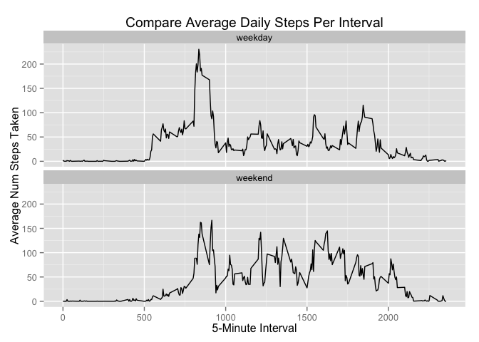

# Reproducible Research: Peer Assessment 1
## Author:  Gloria D Jackson
## Date:  January 9, 2016
## This assignment is used to analyze personal activity data on a fitbit device. The data consists of two months of data from an anonymous individual. The data was collected between October-November 2012.  

## Loading and preprocessing the data

```r
##  load libraries
library(data.table)
library(dplyr)
```

```
## 
## Attaching package: 'dplyr'
```

```
## The following objects are masked from 'package:data.table':
## 
##     between, last
```

```
## The following objects are masked from 'package:stats':
## 
##     filter, lag
```

```
## The following objects are masked from 'package:base':
## 
##     intersect, setdiff, setequal, union
```

```r
library(knitr)
library(kernlab)
library(datasets)
library(ggplot2)

##  read input data file ####
activityd <- data.table(read.csv("activity.csv",na.strings = "NA", header = TRUE, sep = ",")) 
```


## What is mean total number of steps taken per day?

```r
## filter the data to remova 'NA' values
activity1 <- filter(activityd, !is.na(steps))

## calculate the total number of steps taken each day
activitys <- activity1 %>% group_by(date) %>% summarize(sum = sum(steps))

## make a histogram of the total number of steps taken each day 
hist(activitys$sum, xlab = "Total Steps", main = "Total Number Steps per Day", col = "orange")
```

\

```r
##Calculate and report the mean of the total number of steps taken per day 
activitymean <- summarize(activitys,avg = mean(sum))
print.data.frame(activitymean)
```

```
##        avg
## 1 10766.19
```

```r
##Calculate and report the median of the total number of steps taken per day 
activitymedian <- summarize(activitys,mid = median(sum))
print.data.frame(activitymedian)
```

```
##     mid
## 1 10765
```

## What is the average daily activity pattern?

```r
byvar <- activityd %>% group_by(interval)
byvar <- na.omit(byvar)
activityp <- byvar %>% summarize(avg = mean(steps))

plot(activityp$interval, activityp$avg, type = "l", main = "Average Daily Activity Pattern", xlab = "Interval", ylab = "Average Num Steps Taken") 
```

\

```r
## Which 5-min interval, on average across all days in the dataset, contains the maximum number of steps?  Interval 835 with a value of 206 has the maximum average number of steps as shown below:
topactivityp <- top_n(activityp,1,activityp$avg)
print(topactivityp)
```

```
## Source: local data table [1 x 2]
## 
##   interval      avg
##      (int)    (dbl)
## 1      835 206.1698
```

## Imputing missing values

```r
##Calculate and report the total number of missing values in the dataset(i.e. the total number of rows with NAs)
numNAs <- sum(is.na(activityd))
print(numNAs)
```

```
## [1] 2304
```

```r
## Clone a new dataset from activityd
activityd2 <- data.table(activityd)

## calculate the mean number of steps taken each interval to substitute for the NA values
intervalavg <- activity1 %>% group_by(interval) %>% summarize(steps = mean(steps))

imputeNA <- transform(activityd2, steps = ifelse(is.na(activityd2$steps), intervalavg$steps[match(activityd2$interval,intervalavg$interval)],activityd2$steps)) 

## verify no more NA's
numNAs <- sum(is.na(imputeNA))
print(numNAs)
```

```
## [1] 0
```

```r
## Make a histogram of the total number of steps taken each day and Calculate and report the mean and median total number of steps taken per day.  

## calculate the total number of steps taken each day
activitys2 <- imputeNA %>% group_by(date) %>% summarize(sum = sum(steps))

## make a histogram of the total number of steps taken each day 
hist(activitys2$sum, xlab = "Total Steps", main = "Total Number Steps per Day", col = "purple")

##Calculate and report the mean of the total number of steps taken per day 
activitymean2 <- summarize(activitys2,avg = mean(sum))
print.data.frame(activitymean2)
```

```
##        avg
## 1 10766.19
```

```r
##Calculate and report the median of the total number of steps taken per day 
activitymedian2 <- summarize(activitys2,mid = median(sum))
print.data.frame(activitymedian2)
```

```
##        mid
## 1 10766.19
```

```r
## Add histogram for previous non-imputed results
hist(activitys$sum, xlab = "Total Steps", main = "Total Number Steps per Day", col = "orange",add = TRUE)
legend("topright", c("Imputed NAs","Omitted NAs"),lwd = 4,col=c("purple","orange"))
```

\

```r
## What are the differences?
summary(activitys)
```

```
##          date         sum       
##  2012-10-02: 1   Min.   :   41  
##  2012-10-03: 1   1st Qu.: 8841  
##  2012-10-04: 1   Median :10765  
##  2012-10-05: 1   Mean   :10766  
##  2012-10-06: 1   3rd Qu.:13294  
##  2012-10-07: 1   Max.   :21194  
##  (Other)   :47
```

```r
summary(activitys2)
```

```
##          date         sum       
##  2012-10-01: 1   Min.   :   41  
##  2012-10-02: 1   1st Qu.: 9819  
##  2012-10-03: 1   Median :10766  
##  2012-10-04: 1   Mean   :10766  
##  2012-10-05: 1   3rd Qu.:12811  
##  2012-10-06: 1   Max.   :21194  
##  (Other)   :55
```

```r
## Do these values differ from the estimates from the first part of the assignment? YES What is the impact of imputing missing data on the estimates of the total daily number of steps?  By replacing the NA's with the interval averages:  The median for non-imputed is 10765 vs. 10766.19, the mean is the same value of 10766.19 for both, and the imputed data has more total steps than the non-imputed data.
```

## Are there differences in activity patterns between weekdays and weekends?
## It appears that on the weekends, the subject had more steps during between intervals 1000 - 1800.  The trend was about the same between intervals 0-500 and after 2100.

```r
## copy dataset with filled-in values to new dataset
activityd3 <- imputeNA

## add the weekday value and variable to the new dataset
activityd3 <- mutate(activityd3, daytype = weekdays(as.Date(activityd3$date)))
## update weekday values with weekday(Mon-Fri) or weekend (Sat-Sun)
activityd3$daytype <- gsub("Monday","weekday",activityd3$daytype,ignore.case = FALSE, perl = FALSE,fixed = TRUE, useBytes = FALSE)
activityd3$daytype <- gsub("Tuesday","weekday",activityd3$daytype,ignore.case = FALSE, perl = FALSE,fixed = TRUE, useBytes = FALSE)
activityd3$daytype <- gsub("Wednesday","weekday",activityd3$daytype,ignore.case = FALSE, perl = FALSE,fixed = TRUE, useBytes = FALSE)
activityd3$daytype <- gsub("Thursday","weekday",activityd3$daytype,ignore.case = FALSE, perl = FALSE,fixed = TRUE, useBytes = FALSE)
activityd3$daytype <- gsub("Friday","weekday",activityd3$daytype,ignore.case = FALSE, perl = FALSE,fixed = TRUE, useBytes = FALSE)
activityd3$daytype <- gsub("Saturday","weekend",activityd3$daytype,ignore.case = FALSE, perl = FALSE,fixed = TRUE, useBytes = FALSE)
activityd3$daytype <- gsub("Sunday","weekend",activityd3$daytype,ignore.case = FALSE, perl = FALSE,fixed = TRUE, useBytes = FALSE)

##  Make a panel plot containing a time series plot of the 5-minute interval(x-axis) and the average number of steps taken, averaged across all weekday days or weekend days(y-axis).

byvar <- activityd3 %>% group_by(interval,daytype)
activityp2 <- byvar %>% summarize(avg = mean(steps))

p <- qplot(interval,avg,data = activityp2,xlab = "5-Minute Interval", ylab = "Average Num Steps Taken" , type = "l", geom = "line", main = "Compare Average Daily Steps Per Interval")
p + facet_wrap(~ daytype, ncol=1)
```

\
